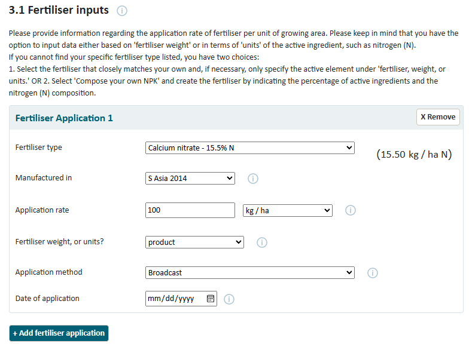
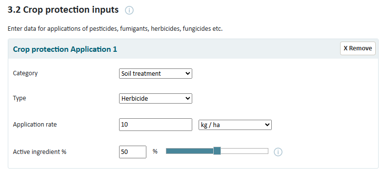

### Residue management:

- Rice straw incorporation less than 30 days before cultivation
- Rice straw incorporation more than 30 days before cultivation
- Removed from field for use or sale
- Burned in field
- Left distributed on field, OR incorporated, OR mulched
- Removed; Forced Aeration Compost
- Removed; non-Forced Aeration Compost
- Removed; left untreated in heaps or pits

---

### Fertiliser inputs

Fertiliser Application Method

- Apply in solution
- Broadcast
- Broadcast or incorporate then flood
- Broadcast to floodwater at panicle initiation
- Incorporate
- Fertigation - subsurface drip

### Crop protection inputs

pesticides, fumigants, herbicides, fungicides etc.

